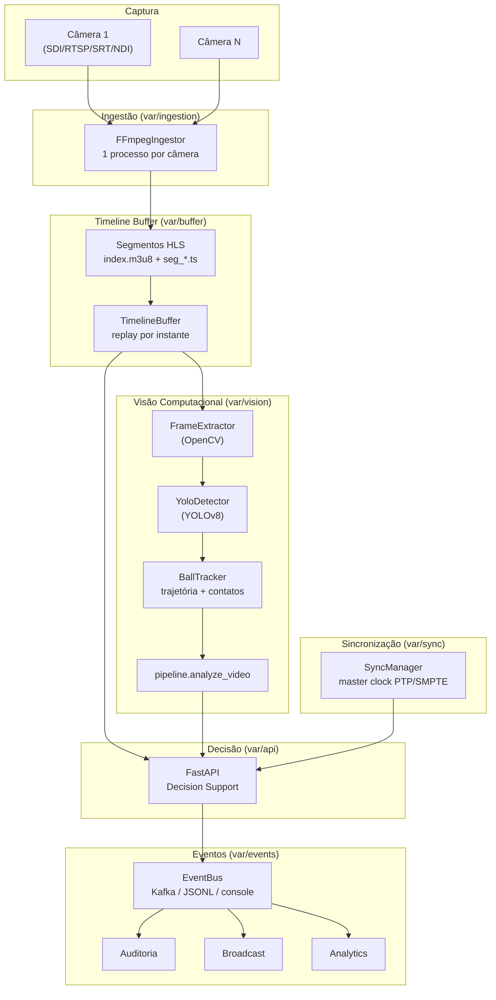
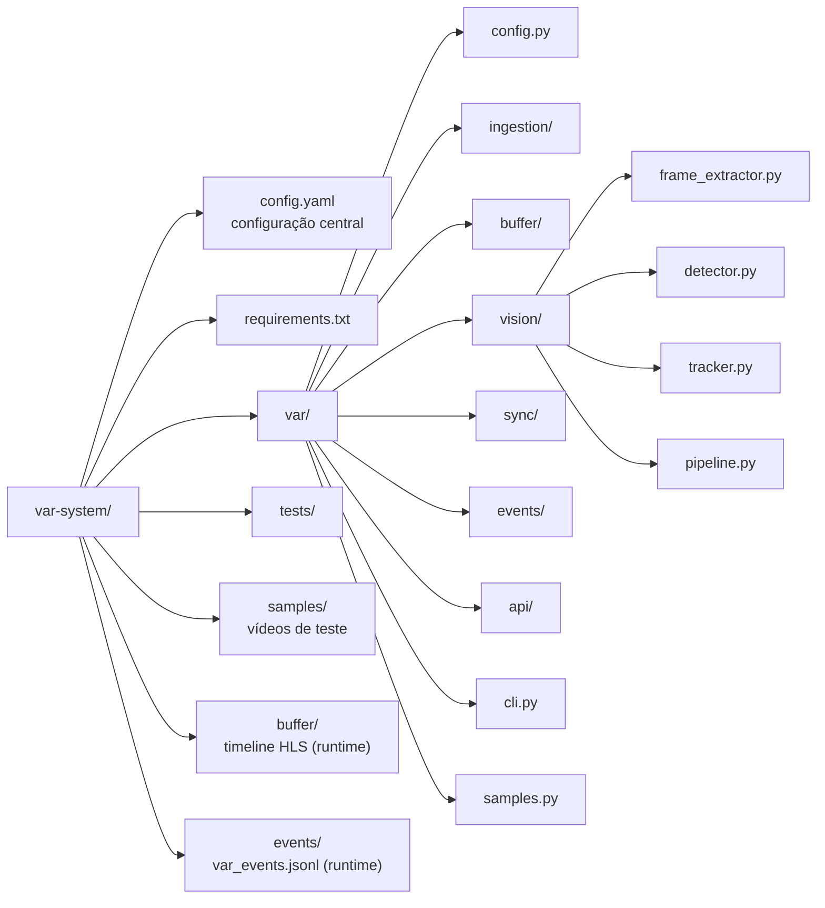
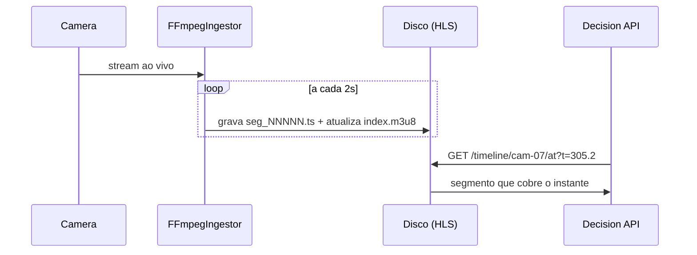
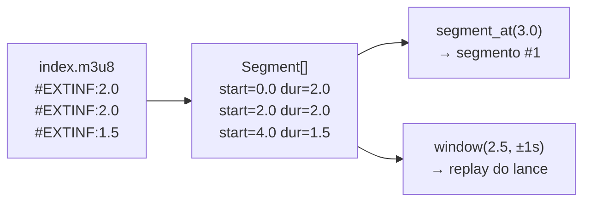
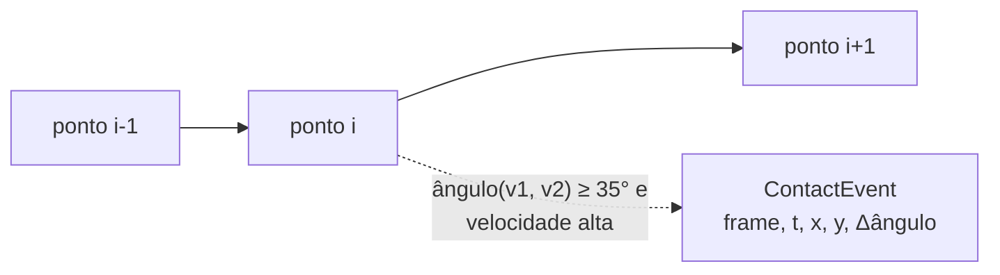
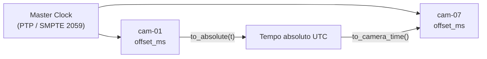
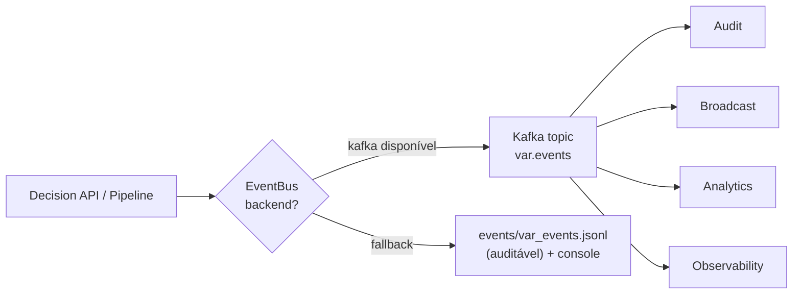
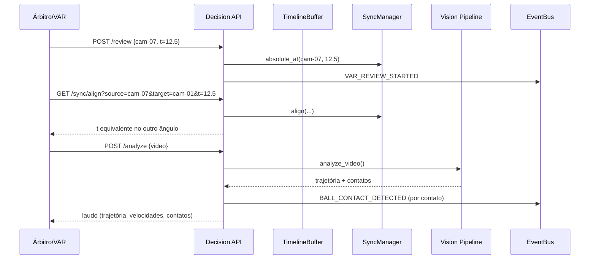
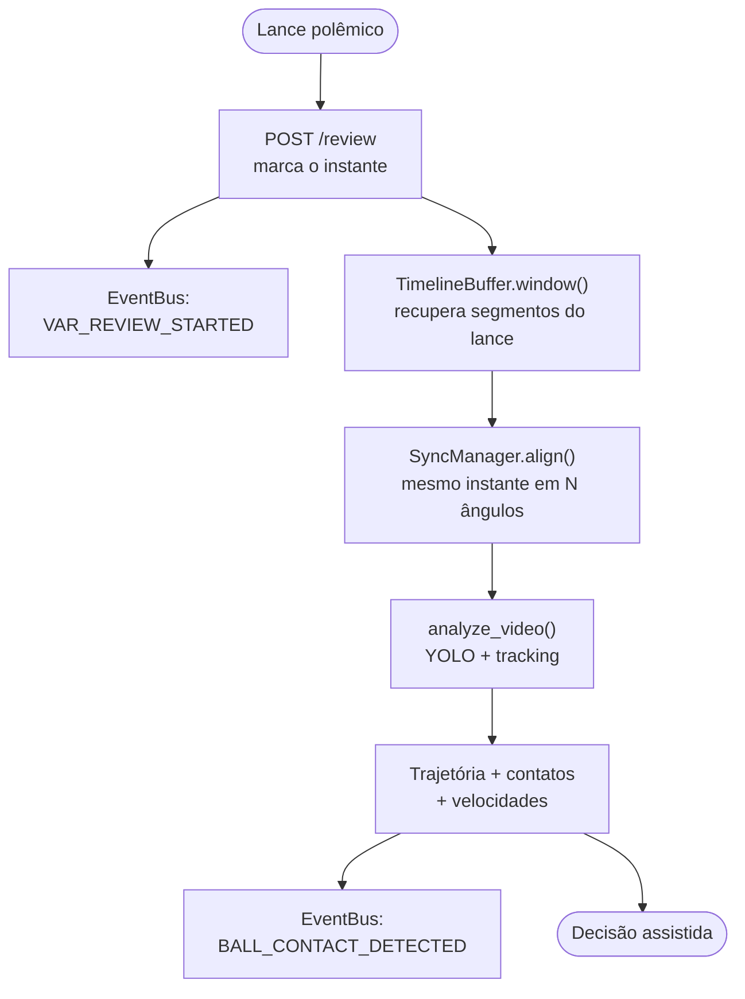

# Construindo um sistema VAR com FFmpeg, OpenCV, YOLO e Python

> Artigo técnico do projeto `var-system`: da captura das câmeras à decisão
> assistida, passando por timeline, visão computacional, sincronização e
> streaming de eventos.

Quando assistimos a uma revisão do VAR, vemos apenas o replay do lance. Por trás
daquela decisão existe um sistema distribuído de baixa latência que captura
múltiplos streams, sincroniza câmeras no mesmo instante, mantém uma timeline
navegável e aplica visão computacional em poucos segundos. Este artigo explica,
módulo a módulo, como o `var-system` implementa esse fluxo em Python.

---

## 1. Visão geral da arquitetura



O sistema é dividido em sete módulos Python independentes, cada um com uma
responsabilidade única e testável isoladamente.

---

## 2. Estrutura de pastas



| Módulo | Arquivo principal | Responsabilidade |
| ------ | ----------------- | ---------------- |
| Config | `config.py` | Carrega `config.yaml` de forma tipada |
| Ingestão | `ingestion/ffmpeg_ingest.py` | FFmpeg: fonte → segmentos HLS |
| Buffer | `buffer/timeline_buffer.py` | Indexa segmentos, replay por instante |
| Visão | `vision/*.py` | Frames, detecção YOLO, tracking, pipeline |
| Sincronização | `sync/clock.py` | Master clock, alinhamento entre ângulos |
| Eventos | `events/event_bus.py` | Kafka com fallback JSONL/console |
| API | `api/decision_api.py` | Endpoints FastAPI de decisão |

---

## 3. Captura e protocolos de vídeo

As câmeras enviam vídeo por diferentes tecnologias conforme o ambiente:

| Tecnologia | Uso principal | Como o `var-system` consome |
| ---------- | ------------- | --------------------------- |
| SDI | Broadcast profissional | Via placa de captura → arquivo/UDP |
| HDMI | Captura local curta | Webcam/placa local |
| RTSP | Câmeras IP | `rtsp://` direto no FFmpeg (TCP) |
| SRT | Streaming seguro/resiliente | `srt://` direto no FFmpeg |
| NDI | Vídeo IP baixa latência | Gateway NDI → UDP |
| SMPTE 2110 | Broadcast IP profissional | Gateway → UDP, sincronizado por PTP |

No `config.yaml`, cada câmera declara apenas sua `source`. O módulo de ingestão
detecta o tipo da fonte e monta os argumentos corretos do FFmpeg
(`var/ingestion/ffmpeg_ingest.py:_source_input_args`).

---

## 4. Ingestão com FFmpeg

Cada câmera roda um processo FFmpeg dedicado que transcodifica o stream de
entrada para **HLS** — uma playlist `.m3u8` com segmentos `.ts` curtos (2s). Esses
segmentos *são* o buffer de timeline: quando o árbitro pede revisão, o sistema não
"volta o vídeo ao vivo", apenas recupera os trechos já gravados.



O comando montado para uma câmera (gerado por `build_command`) é:

```
ffmpeg -hide_banner -loglevel warning -i samples/cam07.mp4 \
  -c:v libx264 -preset veryfast -tune zerolatency -g 100 \
  -f hls -hls_time 2 -hls_list_size 60 -hls_flags delete_segments \
  -hls_segment_filename buffer/cam-07/seg_%05d.ts \
  buffer/cam-07/index.m3u8
```

Pontos de engenharia relevantes:

- **`-g 100`** força um keyframe por segmento (2s × 50fps), garantindo que cada
  `.ts` seja decodificável de forma independente — essencial para "pular" para
  qualquer ponto da timeline.
- **`-tune zerolatency`** reduz o atraso de encoding, crítico para revisão quase
  em tempo real.
- **`delete_segments` + `hls_list_size 60`** implementam uma **janela
  deslizante**: o buffer mantém ~2 minutos por câmera, descartando o passado
  distante. Em produção, esse buffer pode ir para NVMe local, S3/MinIO ou storage
  de vídeo dedicado conforme a latência exigida.

O processo é gerenciado de forma resiliente: stdout/stderr são lidos numa thread
dedicada, e `stop()` faz `terminate()` com fallback para `kill()`.

---

## 5. Timeline buffer navegável

A playlist HLS contém a duração de cada segmento via `#EXTINF`. O
`TimelineBuffer` parseia esses valores e reconstrói uma timeline com **offset
acumulado**, permitindo navegação por instante:



A API expõe isso em duas rotas:

- `GET /timeline/{cam}` — lista todos os segmentos e a duração total no buffer.
- `GET /timeline/{cam}/at?t=305.2` — devolve o segmento que cobre aquele instante,
  já com o **tempo absoluto UTC** correspondente (via sincronização, seção 7).

A função `window(center, before, after)` recupera todos os segmentos que cobrem
`[center-before, center+after]` — exatamente o material que a sala do VAR carrega
ao abrir um lance.

---

## 6. Visão computacional

O subsistema de visão tem quatro peças encadeadas em `pipeline.analyze_video`:

```mermaid
flowchart LR
    VID["Vídeo / Segmento"] --> FE["FrameExtractor<br/>(OpenCV)"]
    FE -->|Frame: número, timestamp, imagem| YD["YoloDetector<br/>(YOLOv8)"]
    YD -->|Detection[]: bola, jogadores| BT["BallTracker"]
    BT --> TRAJ["Trajectory<br/>pontos + contatos + resumo"]
    TRAJ --> EV["BALL_CONTACT_DETECTED<br/>→ EventBus"]
```

### 6.1 Extração de frames (OpenCV)

`FrameExtractor` itera sobre o vídeo entregando, para cada frame, o número, o
**timestamp em segundos** (derivado do FPS) e o buffer de pixels BGR. O parâmetro
`step` subamostra (1 a cada N frames) para acelerar quando não se precisa de
precisão de frame.

### 6.2 Detecção com YOLOv8

`YoloDetector` usa pesos pré-treinados COCO (`yolov8n.pt`), onde a bola é a classe
`sports ball` e jogadores são `person`. O modelo é carregado de forma
**preguiçosa** (import tardio de `ultralytics`/`torch`, que são pesados) e aplica
limiares de confiança independentes por classe (`conf_ball`, `conf_player`).

A cada frame, a saída é uma lista de `Detection` com bounding box, confiança e
centro. `best_ball()` seleciona a bola de maior confiança no frame.

> Nota: para precisão de VAR, treine um modelo dedicado (bola, jogadores,
> árbitros, linhas do campo). O `yolov8n` genérico é o ponto de partida.

### 6.3 Tracking e detecção de contato

`BallTracker` acumula as posições da bola frame a frame e deriva:

- a **trajetória** completa (lista de pontos com timestamp);
- a **velocidade** instantânea em px/s entre pontos consecutivos;
- os **eventos de contato**: pontos onde a direção muda acima de um limiar
  (`35°` por padrão) *e* a velocidade é significativa — candidatos ao momento do
  chute, cabeçada ou desvio.



O resumo (`Trajectory.summary`) entrega velocidade máxima/média, duração rastreada
e número de contatos — o "laudo" que apoia a decisão.

---

## 7. Sincronização entre câmeras

O maior desafio do VAR é garantir que, ao trocar de ângulo, todas as câmeras
mostrem o **mesmo instante** do lance. Em campo isso é resolvido por um *master
clock* distribuído (PTP / IEEE 1588, GPS Time Source, SMPTE ST 2059).



O `SyncManager` modela esse contrato: cada câmera tem um `CameraClock` com um
`epoch` (o instante absoluto correspondente a `t=0` no buffer) e um `offset_ms`
de calibração. A operação central é:

```python
t_target = sync.align(source="cam-01", t_seconds=12.5, target="cam-07")
```

Ela converte `t` da câmera origem para tempo absoluto e de volta para o tempo da
câmera destino — o núcleo da troca de ângulo. Sem isso, mudar de câmera durante a
revisão mostraria momentos diferentes do mesmo lance.

---

## 8. Streaming de eventos

Além do vídeo, o VAR gera eventos auditáveis: início de revisão, contato
detectado, troca de ângulo. O `EventBus` publica para auditoria, broadcast,
analytics e observabilidade.



O design é **degradação graciosa**: se `kafka-python` não estiver instalado ou o
broker não responder, o backend cai automaticamente para um sink em arquivo JSONL
(linha a linha, fácil de auditar) espelhado no console. O mesmo código de
aplicação publica eventos sem saber qual backend está ativo. Exemplo de evento:

```json
{
  "event_type": "VAR_REVIEW_STARTED",
  "match_id": "world-cup-final-2026",
  "timestamp": "2026-06-12T00:45:20.772190+00:00",
  "camera_id": "cam-07",
  "payload": { "t_seconds": 12.5, "reason": "penalty-check" }
}
```

---

## 9. API de suporte à decisão

A sala do VAR é exposta como serviço HTTP (FastAPI). As rotas refletem o fluxo de
uma revisão real:



| Método | Rota | Função |
| ------ | ---- | ------ |
| GET | `/health` | Status do sistema e backend de eventos |
| GET | `/cameras` | Câmeras configuradas |
| GET | `/timeline/{cam}` | Segmentos no buffer |
| GET | `/timeline/{cam}/at?t=` | Segmento que cobre o instante |
| GET | `/sync/align?source=&target=&t=` | Mapeia instante entre ângulos |
| POST | `/review` | Inicia revisão (publica evento) |
| POST | `/analyze` | Roda YOLO + tracking, retorna trajetória |

---

## 10. Fluxo end-to-end de uma revisão



---

## 11. Como rodar

```bash
cd var-system
python -m pip install -r requirements.txt

# Vídeo sintético de teste (não precisa de footage real)
python -m var.cli sample --output samples/cam07.mp4

# Visão: detecção + tracking + contatos
python -m var.cli analyze samples/cam07.mp4 --step 2 --json out.json

# Sincronização entre ângulos
python -m var.cli sync cam-01 cam-07 12.5

# API de decisão (Swagger em /docs)
python -m var.cli api

# Ingestão ao vivo (requer FFmpeg no PATH)
python -m var.cli ingest
python -m var.cli timeline cam-07
```

---

## 12. Conclusão

O VAR não é apenas um replay: é um sistema distribuído de baixa latência que
combina engenharia de vídeo (FFmpeg/HLS), processamento de imagem (OpenCV),
inteligência artificial (YOLO), sincronização de tempo (PTP/SMPTE) e streaming de
eventos (Kafka). O `var-system` prototipa todo esse fluxo em Python com módulos
desacoplados, cada um testável e substituível — do laboratório ao caminho de
evolução para produção (modelo treinado, storage dedicado, master clock real e
broker Kafka).
